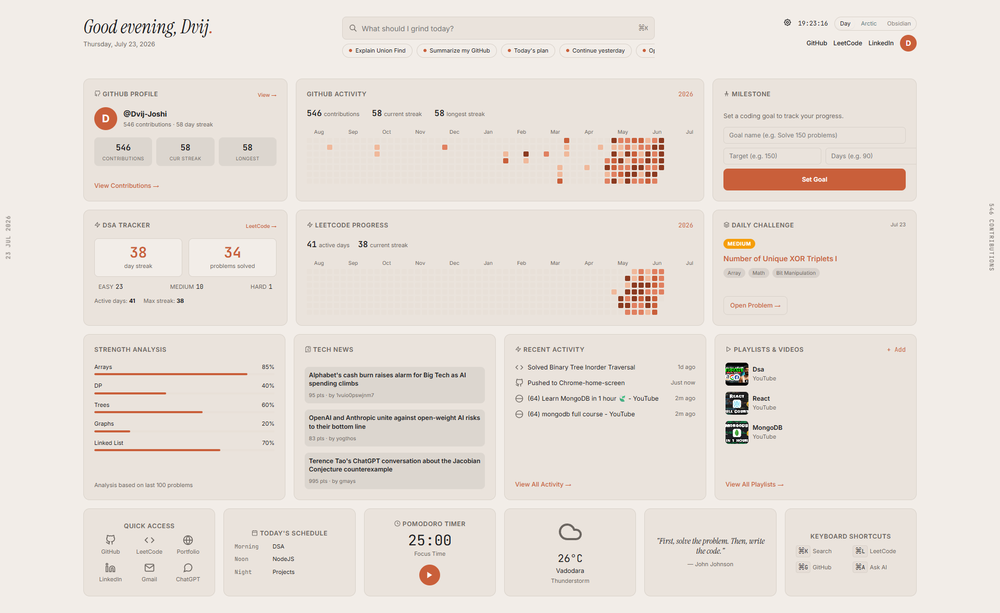
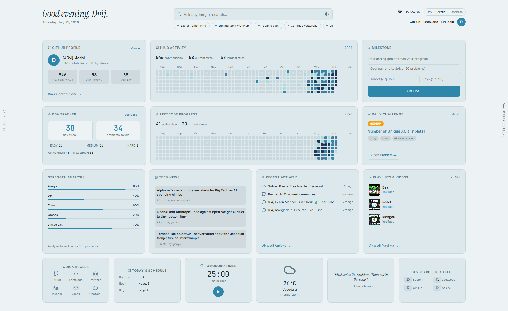
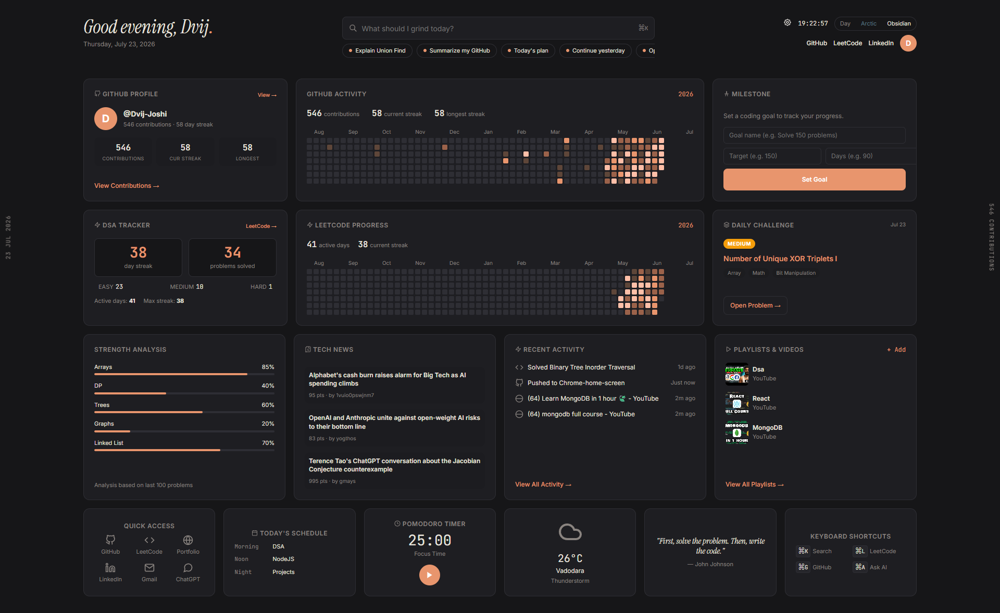

# 🖥️ Developer Dashboard — Chrome New Tab

A beautiful, personal developer dashboard that replaces your Chrome New Tab page. Built for developers grinding DSA and shipping projects — editorial aesthetic, warm palette, zero frameworks.

## 📸 Preview

| Day | Arctic | Obsidian |
|-----|--------|----------|
|  |  |  |

---

## ✨ Features

| Card | What it does |
|------|-------------|
| **GitHub Profile & Activity** | Live contribution heatmap + streak stats pulled from GitHub's public API |
| **DSA Tracker** | Tracks your LeetCode solved count, streak, and difficulty breakdown |
| **LeetCode Progress** | Full submission calendar heatmap via LeetCode's official GraphQL API |
| **Daily Challenge** | Today's LeetCode problem with difficulty and topic tags |
| **Tech News** | Top developer stories from Hacker News |
| **Recent Activity** | Last solved LC problem, last GitHub push, last 2 sites visited |
| **Strength Analysis** | Visual breakdown of your topic proficiency |
| **Playlists & Videos** | Saved YouTube playlists for study sessions |
| **Milestone Tracker** | Set a coding goal and track progress |
| **Smart Search** | Routes to Groq AI, Google, or a direct URL based on what you type |
| **3 Themes** | Daylight · Arctic · Obsidian — saved across sessions |

---

## 🚀 Installation Guide

This extension is loaded as an **unpacked extension** directly from your local files. No Chrome Web Store required.

### Step 1 — Download the code

**Option A — Clone with Git:**
```bash
git clone https://github.com/Dvij-Joshi/Chrome-home-screen.git
cd Chrome-home-screen
```

**Option B — Download ZIP:**
1. Click the green **Code** button on this page
2. Select **Download ZIP**
3. Unzip the folder somewhere permanent (e.g. `Documents/chrome-dashboard`)

> ⚠️ **Important:** Don't move or delete the folder after installing — Chrome loads the extension from this location every time.

---

### Step 2 — Load the extension into Chrome

1. Open Chrome and go to: **`chrome://extensions`**
2. Toggle **Developer mode** ON (top-right corner)
3. Click **Load unpacked**
4. Select the folder you downloaded (the one containing `manifest.json`)
5. The extension will appear in your list as **"Developer Dashboard"**

---

### Step 3 — Open a new tab

Press **Ctrl + T** (or **⌘ + T** on Mac) to open a new tab.  
You should now see the dashboard!

---

## ⚙️ First-time Configuration

On your first visit, open **Settings** (gear icon in the top-right) and fill in:

| Setting | Where to get it | Required? |
|---------|----------------|-----------|
| **GitHub Username** | Your GitHub profile username | Yes, for heatmap |
| **LeetCode Username** | Your LeetCode profile username | Yes, for DSA stats |
| **Groq API Key** | [console.groq.com](https://console.groq.com) → API Keys → Create key (free) | Yes, for AI search |
| **Weather City** | Just type your city name | Optional |
| **LinkedIn URL** | Your full LinkedIn profile URL | Optional |

---

## 🔄 Updating

If you cloned the repo, just pull the latest changes and reload the extension:

```bash
git pull origin master
```

Then go to `chrome://extensions` → click the **↺ Reload** button on the Developer Dashboard card.

> **Note:** After any update to `manifest.json`, you must reload the extension (not just refresh the tab) for the changes to take effect.

---

## 🛠️ Tech Stack

- **Vanilla HTML, CSS, JS** — zero dependencies, zero frameworks
- **LeetCode GraphQL API** (`leetcode.com/graphql`) — official, no key required
- **GitHub Contributions API** (`github-contributions-api.jogruber.de`) — public, no key required
- **Groq AI** (`api.groq.com`) — free tier, requires API key
- **Hacker News Algolia API** — public, no key required
- **Open-Meteo** — free weather API, no key required
- **Google Fonts** — Instrument Serif · Inter · JetBrains Mono

---

## 🎨 Themes

Switch themes using the buttons in the top-right corner. Your preference is saved automatically.

| Theme | Description | Preview |
|-------|-------------|---------|
| **Day** | Warm paper tones — the default editorial look |  |
| **Arctic** | Clean cool whites and blue-greys |  |
| **Obsidian** | Deep dark mode with amber accents |  |

---

## 🐛 Troubleshooting

**LeetCode data not loading?**
- Make sure your LeetCode username is set correctly in Settings (no `@`)
- Open `chrome://extensions` and click **Reload** on the extension — this refreshes the permissions

**GitHub heatmap not showing?**
- Confirm your GitHub username is correct (case-sensitive)
- The API fetches public contributions only

**"Could not load today's problem"?**
- This is cached daily — try opening a new tab tomorrow, or clear your extension's localStorage via DevTools → Application → Local Storage

**Extension not appearing after install?**
- Make sure Developer Mode is enabled on `chrome://extensions`
- Make sure you selected the folder containing `manifest.json`, not a parent folder

---

## 📁 Project Structure

```
chrome-home-screen/
├── index.html       # Entire UI — all HTML + CSS in one file
├── script.js        # All JS logic — data fetching, rendering, settings
├── manifest.json    # Chrome extension config
└── assets/          # Image assets (textures, icons)
```

---

## 🙏 Credits

- LeetCode daily problems via [LeetCode GraphQL API](https://leetcode.com/graphql)
- GitHub contributions via [jogruber's contributions API](https://github-contributions-api.jogruber.de)
- AI powered by [Groq](https://groq.com)

---

*Made by [@Dvij-Joshi](https://github.com/Dvij-Joshi)*
